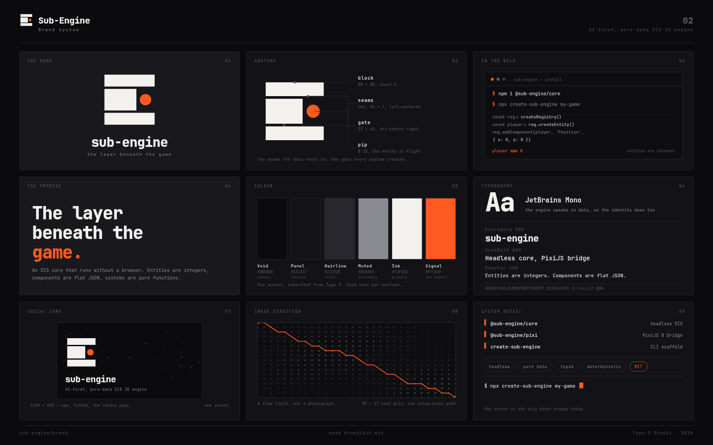

# Sub-Engine — identity

The logo is a **block in section**. An ECS engine is a substrate: entities are
integers sitting on flat data, systems are pure functions crossing them every
tick. So the mark is solid, load-bearing material — cut by **two seams** (the
layers the data rests on) and **one gate** (the channel every system has to
cross). The single orange pip inside the gate is the one entity in flight, and
it is the only thing in the mark that moves.

<p align="center">
  
</p>

## Plates

| File | What it is |
|---|---|
| `01-mark-exploration.{svg,png}` | The six directions the mark was resolved from, its construction, and the reduction test that decides the 16px cut |
| `02-brand-system.{svg,png}` | The whole identity on one 3×3 board |
| `03-spec.{svg,png}` | What ships, clearspace, minimum size, lockup, the four prohibitions, and where each asset installs |
| `og-image.{svg,png}` | 1200 × 630 social card — npm, GitHub, X, Slack |

## Assets

| File | What it is | Shipped as |
|---|---|---|
| `assets/mark.svg` | Primary mark, 100×100, `#0B0B0D` + Signal — **32px and up**, light surfaces | `assets/logo-mark.svg` |
| `assets/mark-inverse.svg` | Same, `#F2F1EE` for dark surfaces | `assets/logo-mark-inverse.svg` |
| `assets/mark-flat.svg` | Single ink, no accent — for light surfaces that cannot carry colour | `assets/logo-mark-flat.svg` |
| `assets/mark-flat-inverse.svg` | Single ink for dark surfaces | `assets/logo-mark-flat-inverse.svg` |
| `assets/favicon.svg` | **Designed** 16px cut — **below 32px** | `assets/favicon.svg` |
| `assets/lockup.svg` | Horizontal lockup, 5:1, fully outlined | `assets/logo-lockup.svg` |
| `assets/lockup-inverse.svg` | The lockup for dark surfaces | `assets/logo-lockup-inverse.svg` |
| `assets/wordmark.svg` | The name alone, outlined | `assets/logo-wordmark.svg` |
| `assets/og-image.png` | 1200 × 630 | `assets/og-image.png` |
| `assets/icon-{512,192,180}.png` | Raster marks, for the places that will not take an SVG | `assets/icon-*.png` |

The 16px cut is **redrawn, not scaled**: at 16px a 4-unit seam is two thirds
of a pixel and the Ø20 pip smears, so the cut opens the seams to 12 units,
squares up the gate, and grows the pip to Ø30. Same silhouette language,
resolved for pixels instead of intent.

**The wordmark is outlined to paths, not live text.** An SVG loaded as an
`` — which is how GitHub, npm and every site load it — is an isolated
document and cannot reach the page's `@font-face`. A live `<text>` would have
to inline the font, which costs hundreds of KB on every page load. The
outlines are 6 KB and renderer-independent.

## Relationship to Type-3 Studio

Sub-Engine is a **sibling**, not a copy. It borrows exactly one thing: solar
orange `#FF5A1F` as the single accent, so a reader who has seen the studio
mark sees the same house. Everything else is its own — a cooler, darker ground
because an engine is a tool you run at night, and a monospaced voice because
the engine speaks in data.

| | Type-3 Studio | Sub-Engine |
|---|---|---|
| Mark | Dyson swarm, a star ringed by collectors | Block in section, two seams and a gate |
| Ground | `#EDEBE6` paper, light-first | `#0B0B0D` void, dark-first |
| Accent | Solar orange, reserved for the star | Solar orange, reserved for the pip |
| Voice | Display serif, italic | Monospace |

## Colour

| Swatch | Hex | Role |
|---|---|---|
| Void | `#0B0B0D` | Canvas ground |
| Panel | `#131317` | Board and card surface |
| Hairline | `#27272D` | Rules, borders |
| Muted | `#8A8A93` | Secondary text |
| Ink | `#F2F1EE` | Primary foreground |
| Paper | `#EDEBE6` | Light surfaces |
| **Signal** | `#FF5A1F` | **The accent — one per surface** |

## Typography

**JetBrains Mono** (SIL Open Font License), and nothing else. The engine
speaks in data — entities are integers, components are flat JSON — so the
identity does too. One typeface across the whole system: ExtraBold 800 for the
wordmark and headlines, SemiBold 600 for labels and emphasis, Regular 400 for
body and code, Medium 500 for navigation.

No font is shipped. Anything that has to render without the reader's machine
owning the font is outlined to paths.

## Voice

Short, factual, and never impressed by itself. The engine's own README already
has the right lines — *entities are integers*, *no browser needed for game
logic* — and the brand borrows them rather than inventing slogans.

- Tagline: **The layer beneath the game.**
- Supporting: *Entities are integers. Components are flat JSON. Systems are pure functions.*
- Never: "supercharge", "seamless", "next-generation", "unleash", "the future of"

## Rebuilding

```bash
node brand/explore.mjs   # plate 01
node brand/kit.mjs       # plate 02
node brand/spec.mjs      # plate 03
node brand/og.mjs        # the social card
node brand/export.mjs    # assets/
brand/render.sh          # boards + card -> docs/brand/*.png
```

`brand/tools/outline-wordmark.py` regenerates `wordmark.mjs`; it needs
fonttools and runs only when the wordmark text or typeface changes.
`brand/render.sh` itself has no Python dependency.

`substrate()` in `marks.mjs` is the single parametric source for the mark, the
16px cut and every exploration variant on plate 01, so a change to the geometry
propagates everywhere rather than leaving three drawings to drift.

Boards are rasterised with headless Chrome and seeded PRNGs, so a rebuild is
byte-stable — a diff on `docs/brand/` means something actually changed.